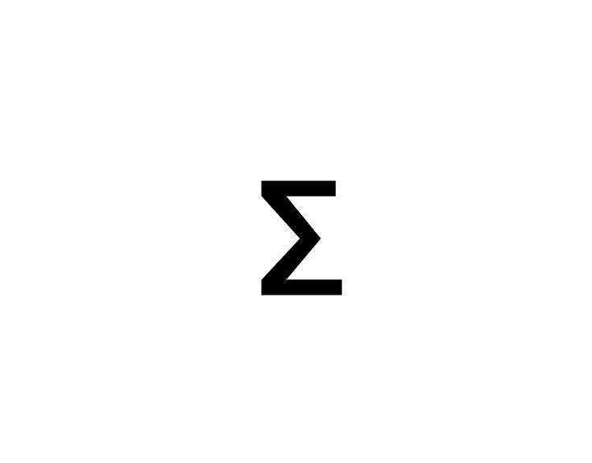

# Euphoriae

<p align="center">
  
</p>

<p align="center">
  <b>A modern local music player for Android</b><br>
  <i>Euphoriae is a free & open source music player inspired by the Greek word “Euphoria.”</i>
</p>

<p align="center">
  
  
  
  
</p>

---

## Features

- **Local Music Playback**: Play your local audio files with high-quality ExoPlayer
- **Playlist Management**: Create, edit, and manage your playlists
- **Equalizer**: EQ with presets, bass boost & virtualizer
- **Material You**: Dynamic theming based on your wallpaper
- **Playback Modes**: Shuffle and repeat (all/one) support
- **Search**: Quickly find your songs
- **Modern UI**: Clean, intuitive interface with smooth animations
- **Typography**: Plus Jakarta Sans

## Screenshots

<p align="center">
  
  
  
  
  
</p>

<p align="center">
  
  
  
  
  
</p>

## Tech Stack

| Category | Technology |
|----------|------------|
| Language | Kotlin 2.0 |
| UI | Jetpack Compose + Material Design 3 |
| Media | Media3 ExoPlayer & MediaSession |
| Database | Room Persistence Library |
| Image Loading | Coil |
| Architecture | MVVM with StateFlow |

## Getting Started

### Prerequisites
- Android Studio Otter 2
- Android SDK 25+
- Kotlin 2.0+

### Build
```bash
# Clone the repository
git clone https://github.com/ellenoireQ/euphoriae.git

# Open in Android Studio and sync Gradle

# Run on device/emulator
```

## Project Structure

```
app/src/main/java/com/oss/euphoriae/
├── data/
│   ├── class/          # Player & Audio Effects
│   ├── local/          # Room Database & DAO
│   ├── model/          # Data classes (Song, Playlist)
│   └── repository/     # Music Repository
├── service/            # Media Playback Service
├── ui/
│   ├── components/     # Reusable UI components
│   ├── screens/        # App screens
│   ├── theme/          # Material You theming
│   └── viewmodel/      # ViewModels
├── EuphoriaeApp.kt     # Application class
└── MainActivity.kt     # Main entry point
```

## License

```
MIT License

Copyright (c) 2025 Euphoriae

Permission is hereby granted, free of charge, to any person obtaining a copy
of this software and associated documentation files (the "Software"), to deal
in the Software without restriction, including without limitation the rights
to use, copy, modify, merge, publish, distribute, sublicense, and/or sell
copies of the Software, and to permit persons to whom the Software is
furnished to do so, subject to the following conditions:

The above copyright notice and this permission notice shall be included in all
copies or substantial portions of the Software.

THE SOFTWARE IS PROVIDED "AS IS", WITHOUT WARRANTY OF ANY KIND, EXPRESS OR
IMPLIED, INCLUDING BUT NOT LIMITED TO THE WARRANTIES OF MERCHANTABILITY,
FITNESS FOR A PARTICULAR PURPOSE AND NONINFRINGEMENT. IN NO EVENT SHALL THE
AUTHORS OR COPYRIGHT HOLDERS BE LIABLE FOR ANY CLAIM, DAMAGES OR OTHER
LIABILITY, WHETHER IN AN ACTION OF CONTRACT, TORT OR OTHERWISE, ARISING FROM,
OUT OF OR IN CONNECTION WITH THE SOFTWARE OR THE USE OR OTHER DEALINGS IN THE
SOFTWARE.
```

## 🤝 Contributing

Contributions are welcome! Feel free to:

1. Fork the repository
2. Create a feature branch (`git checkout -b feature/amazing-feature`)
3. Commit your changes (`git commit -m 'Add amazing feature'`)
4. Push to the branch (`git push origin feature/amazing-feature`)
5. Open a Pull Request


---

