# Euphoriae

<p align="center">
  
</p>

<p align="center">
  <b>A modern local music player for Android</b><br>
  <i>Euphoriae is a free & open source music player inspired by the Greek word “Euphoria.”</i>
</p>

<p align="center">
  
  
  
  
</p>

---

## Features

- **Local Music Playback**: Play your local audio files with high-quality ExoPlayer
- **Playlist Management**: Create, edit, and manage your playlists
- **Equalizer**: EQ with presets, bass boost & virtualizer
- **Material You**: Dynamic theming based on your wallpaper
- **Playback Modes**: Shuffle and repeat (all/one) support
- **Search**: Quickly find your songs
- **Modern UI**: Clean, intuitive interface with smooth animations
- **Typography**: Plus Jakarta Sans

## Screenshots

<p align="center">
  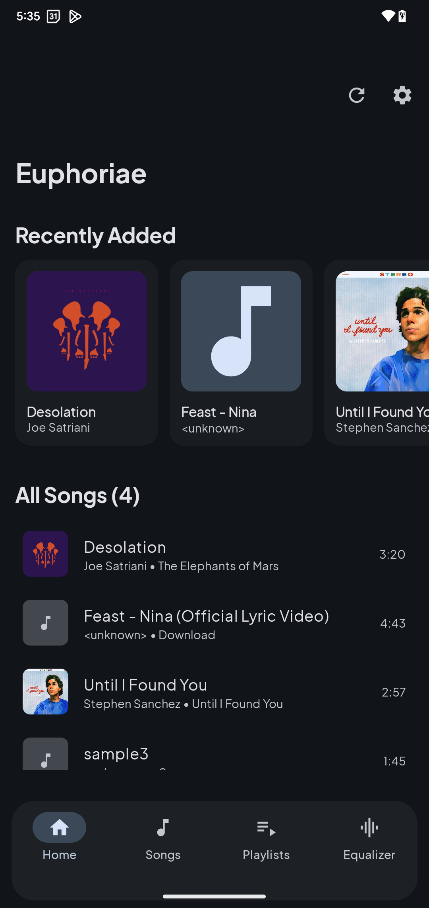
  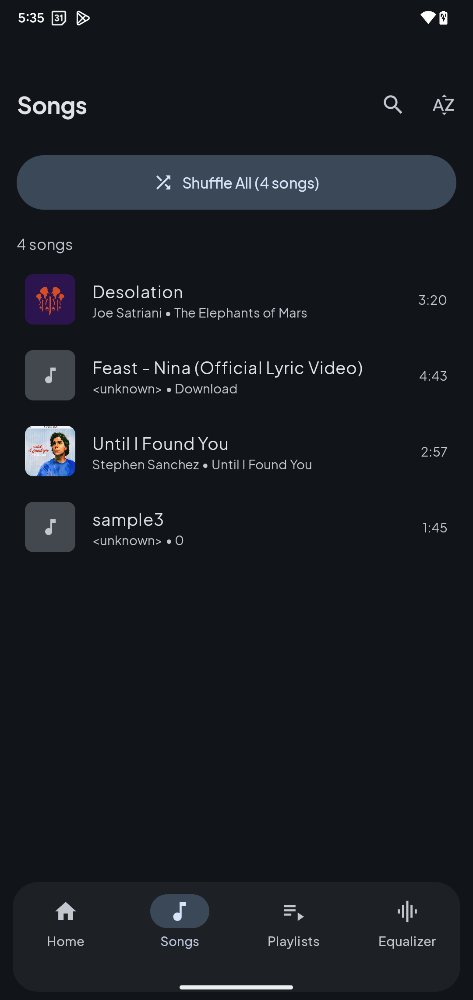
  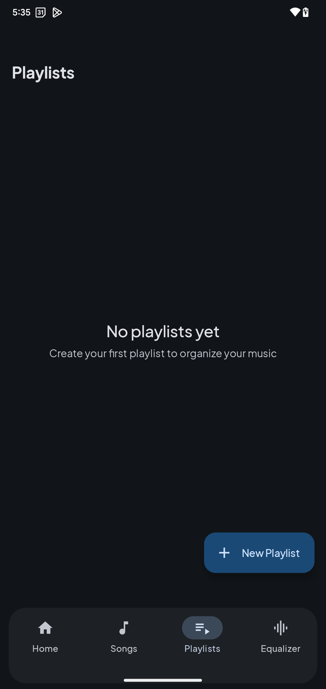
  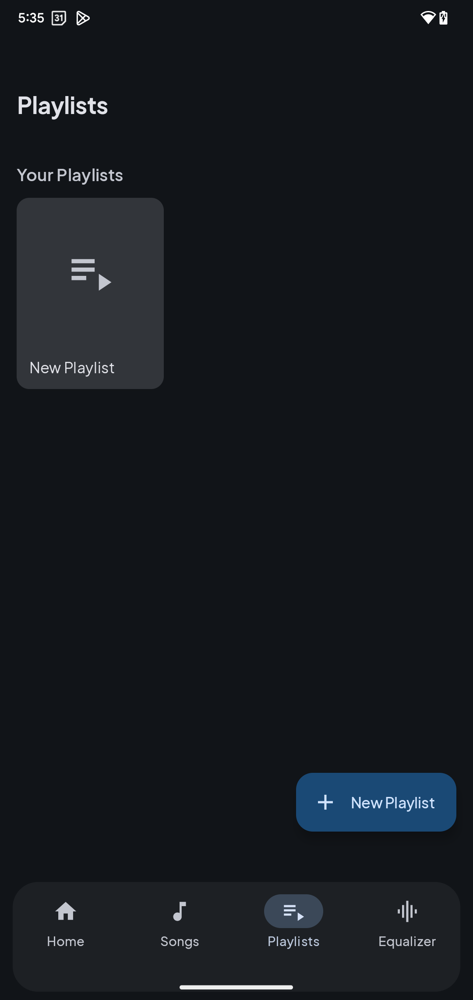
  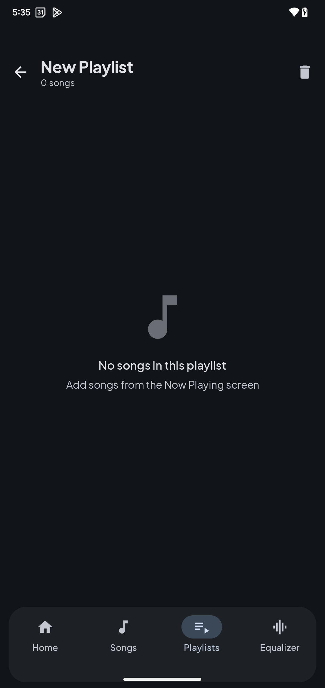
</p>

<p align="center">
  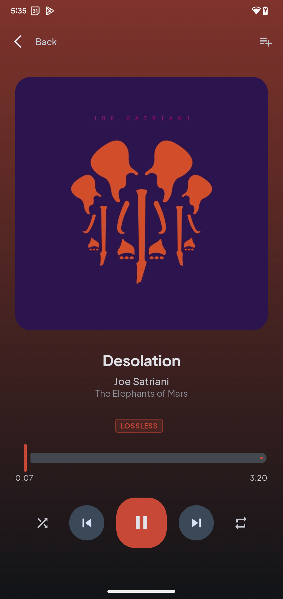
  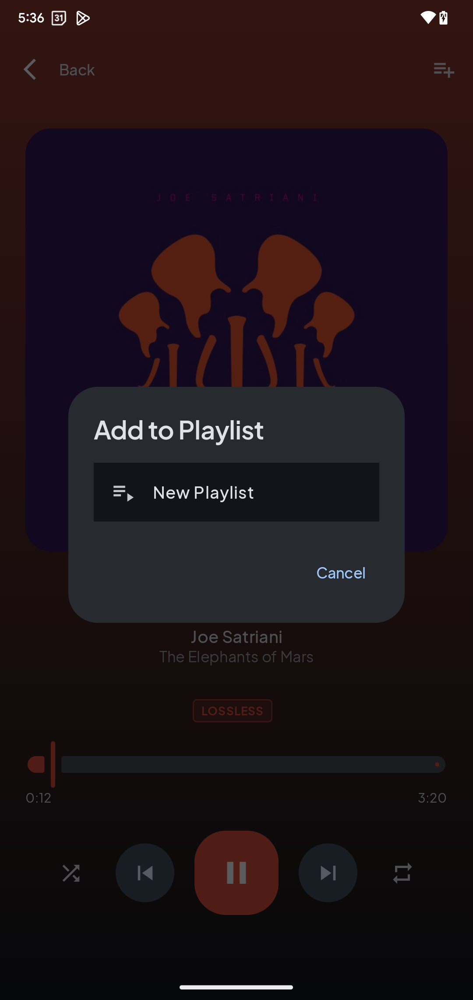
  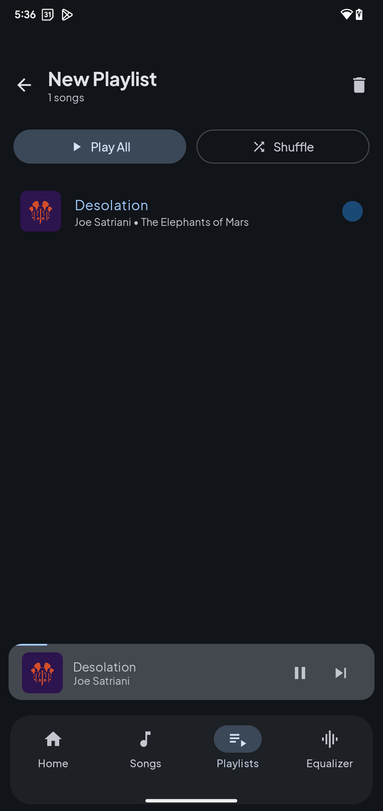
  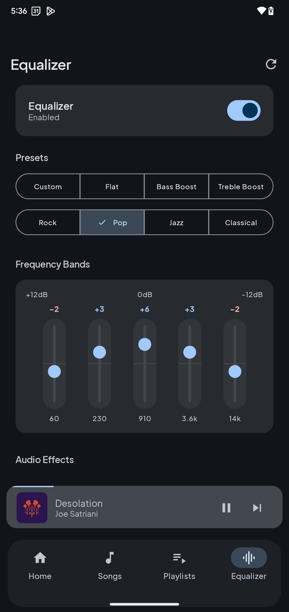
  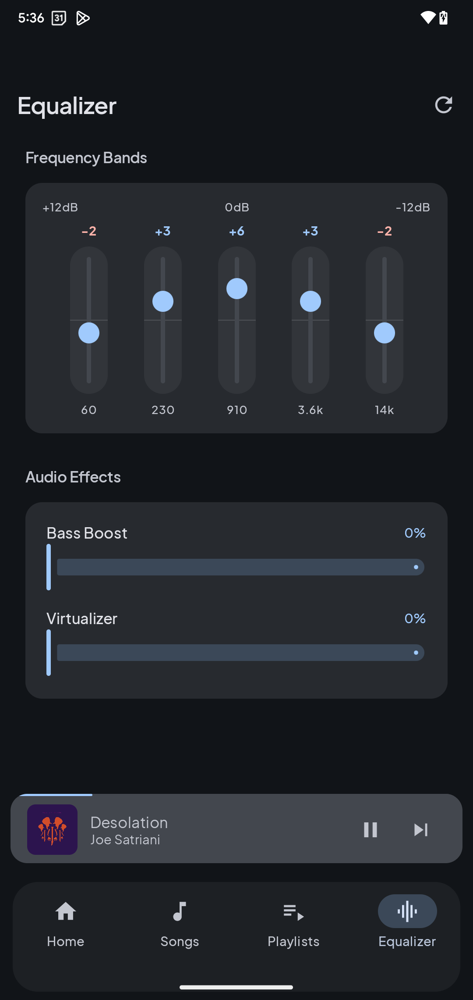
</p>

<p align="center">
  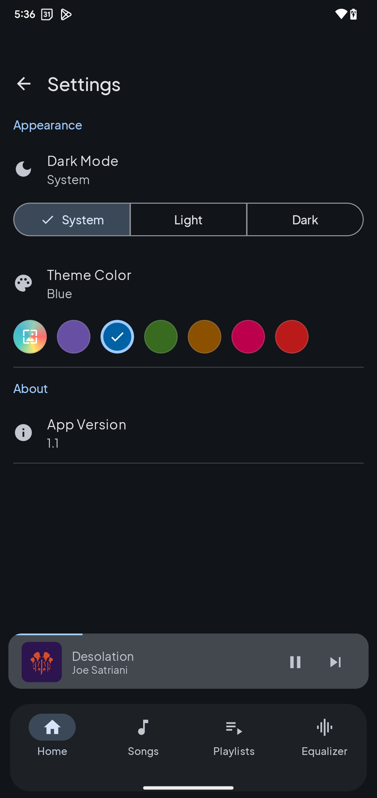
  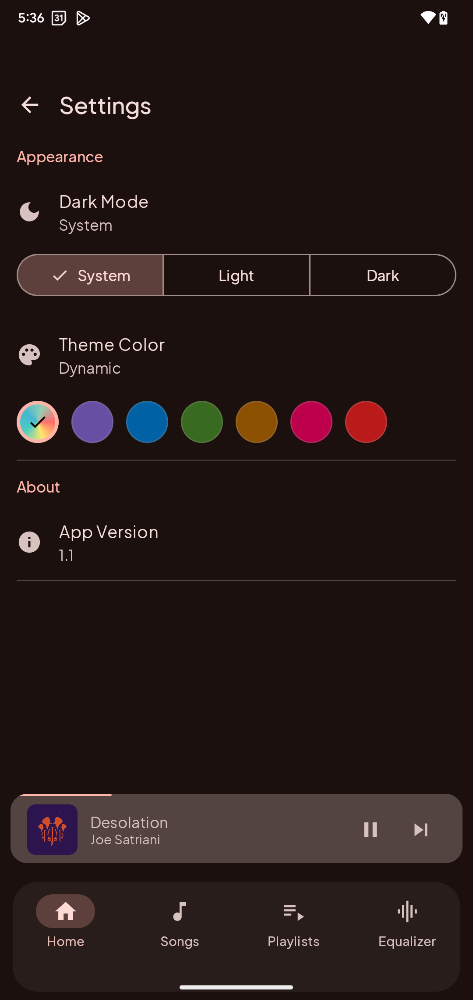
  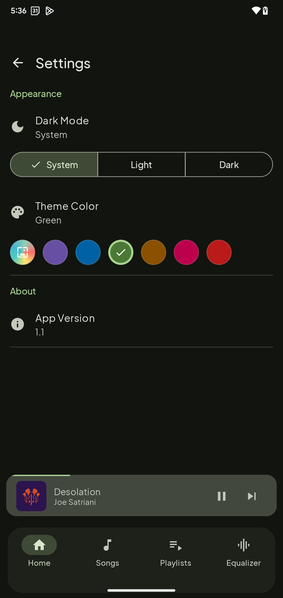
  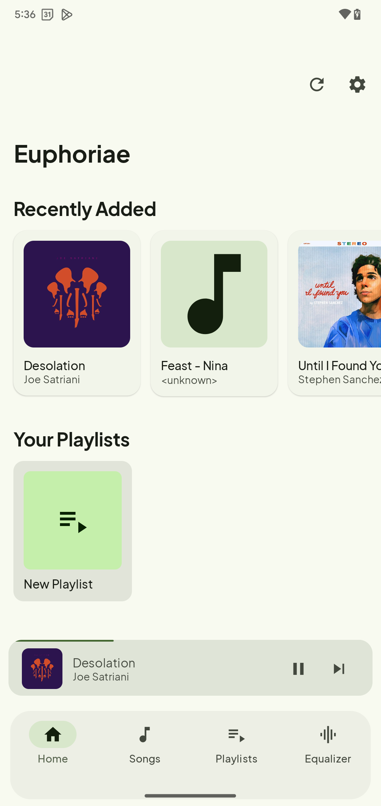
</p>

## Tech Stack

| Category | Technology |
|----------|------------|
| Language | Kotlin 2.0 |
| UI | Jetpack Compose + Material Design 3 |
| Media | Media3 ExoPlayer & MediaSession |
| Database | Room Persistence Library |
| Image Loading | Coil |
| Architecture | MVVM with StateFlow |

## Getting Started

### Prerequisites
- Android Studio Otter 2
- Android SDK 25+
- Kotlin 2.0+

### Build
```bash
# Clone the repository
git clone https://github.com/ellenoireQ/euphoriae.git

# Open in Android Studio and sync Gradle

# Run on device/emulator
```

## Project Structure

```
app/src/main/java/com/oss/euphoriae/
├── data/
│   ├── class/          # Player & Audio Effects
│   ├── local/          # Room Database & DAO
│   ├── model/          # Data classes (Song, Playlist)
│   └── repository/     # Music Repository
├── service/            # Media Playback Service
├── ui/
│   ├── components/     # Reusable UI components
│   ├── screens/        # App screens
│   ├── theme/          # Material You theming
│   └── viewmodel/      # ViewModels
├── EuphoriaeApp.kt     # Application class
└── MainActivity.kt     # Main entry point
```

## License

```
  Copyright 2025 Euphoriae
 
  Licensed under the Apache License, Version 2.0 (the "License");
  you may not use this file except in compliance with the License.
  You may obtain a copy of the License at
 
      http://www.apache.org/licenses/LICENSE-2.0
 
  Unless required by applicable law or agreed to in writing, software
  distributed under the License is distributed on an "AS IS" BASIS,
  WITHOUT WARRANTIES OR CONDITIONS OF ANY KIND, either express or implied.
  See the License for the specific language governing permissions and
  limitations under the License.
```

## 🤝 Contributing

Contributions are welcome! Feel free to:

1. Fork the repository
2. Create a feature branch (`git checkout -b feature/amazing-feature`)
3. Commit your changes (`git commit -m 'Add amazing feature'`)
4. Push to the branch (`git push origin feature/amazing-feature`)
5. Open a Pull Request


---


